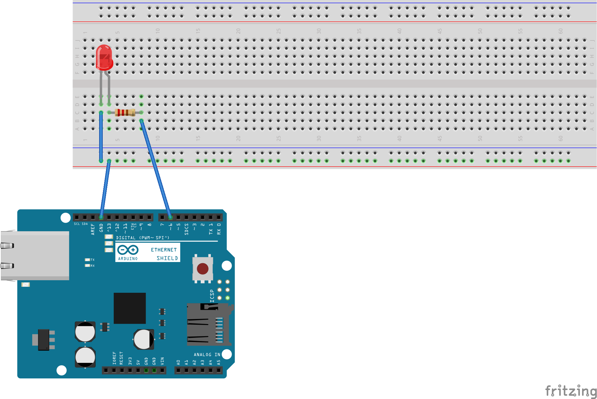
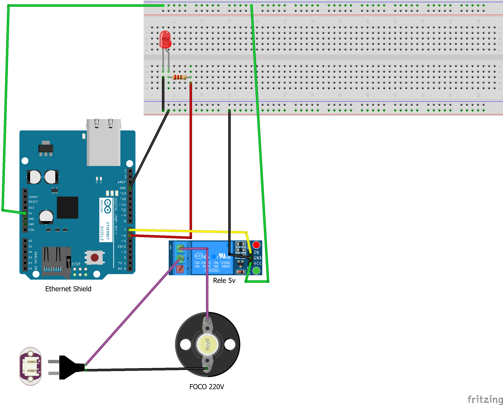
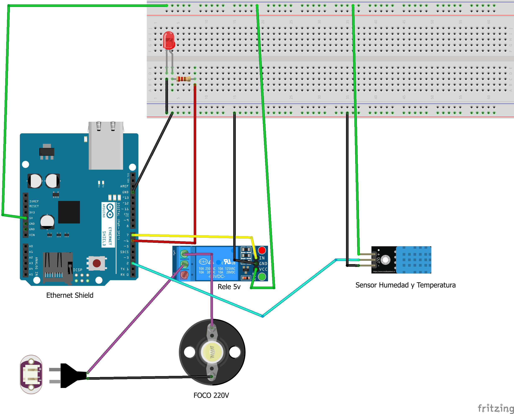

# Robotica_01

# 🌐 Control Web con Arduino (Ethernet + DHT11 + Motor + Relé)

Este proyecto permite controlar un foco, un LED, y un motor paso a paso a través de una página web, además de monitorear en tiempo real la temperatura y la humedad usando un sensor DHT11.

---

## 🧰 Tecnologías y Componentes

### 🔌 Electrónica
- Arduino UNO
- Módulo Ethernet W5100
- Sensor DHT11
- Módulo Relé 5V
- LED Azul
- Resistencia 220Ω
- Motor paso a paso (28BYJ-48 o NEMA 23)
- Driver DRV8825
- Fuente de alimentación externa (para el motor)

### 💻 Software
- IDE de Arduino
- Librerías:
  - `Ethernet.h`
  - `SPI.h`
  - `DHT.h`
  - `ArduinoJson.h`

---

## ⚡ Esquema Electrónico

```text
[DHT11]          → Pin 2  
[LED Azul]       → Pin 6  
[Relé 220V]      → Pin 7  
[Motor DRV8825]  → Step=8, Dir=9, Enable=10  
[Ethernet W5100] → Conectado por SPI 
```


## 🔹 1. Conexión del LED Azul

### 🧩 Componentes necesarios:
- 1 x LED azul
- 1 x Resistencia de 220Ω
- Cables dupont

### ⚙️ Conexiones:
| Elemento                      | Arduino UNO     |
|-------------------------------|------------------|
| Ánodo (patita larga) del LED  | Pin digital 6    |
| Cátodo (patita corta) del LED | GND (a través de la resistencia de 220Ω) |

> ⚠️ **Importante**: La resistencia es necesaria para evitar quemar el LED. Conéctala entre el cátodo del LED y tierra (GND).

### 🔌 Esquema Fritzing:


### 💡 Funcionamiento:
El LED se controla desde el navegador web. Al acceder a las rutas:
- `/ONA` → Enciende el LED (HIGH en pin 6)
- `/OFFA` → Apaga el LED (LOW en pin 6)

Esto se logra gracias a la interfaz web servida por el módulo Ethernet W5100.

## 🔹 2. Conexión del Foco 220V con Relé

### 🧩 Componentes necesarios:
- 1 x Módulo Relé de 1 canal (5V)
- 1 x Foco o bombilla 220V (puede ser incandescente o LED)
- 1 x Portafoco
- Cableado para 220V (con precaución)
- Cables dupont

### ⚙️ Conexiones (lado Arduino):
| Módulo Relé | Arduino UNO |
|-------------|--------------|
| IN          | Pin digital 7 |
| VCC         | 5V           |
| GND         | GND          |

### ⚠️ Conexiones (lado 220V CA):
- **COM** (común): uno de los cables del foco.
- **NO** (normalmente abierto): cable vivo de 220V.
- El otro cable del foco va directo al neutro de 220V.

> ⚠️ **Precaución**: Este montaje trabaja con corriente alterna. Asegúrate de desconectar la energía antes de conectar el relé al foco y utiliza cinta aislante o terminales seguros. Si no estás familiarizado con electricidad domiciliaria, busca ayuda de un técnico.

### 🔌 Esquema Fritzing:


### 💡 Funcionamiento:
Desde el navegador puedes encender y apagar el foco con estas rutas:
- `/ONR` → Activa el relé (enciende el foco)
- `/OFFR` → Desactiva el relé (apaga el foco)

El pin 7 del Arduino controla el pin IN del relé. Cuando se activa (`LOW` en relés activos bajos), el relé cierra el contacto y permite el paso de corriente al foco.

## 🔹 3. Conexión del Sensor DHT11

### 🧩 Componentes necesarios:
- 1 x Sensor DHT11
- 1 x Resistencia de 10kΩ (pull-up, opcional pero recomendada)
- Cables dupont

### ⚙️ Conexiones:
| Pin DHT11 | Arduino UNO |
|-----------|--------------|
| VCC       | 5V           |
| DATA      | Pin digital 2 |
| GND       | GND          |

> 🔧 **Nota**: Puedes colocar una resistencia de **10kΩ** entre VCC y DATA como resistencia de pull-up para una mejor estabilidad de la señal.

### 🔌 Esquema Fritzing:


### 🌡️ Funcionamiento:
El sensor se inicializa en el código con la librería `DHT.h`, usando:

```cpp
#define DHTPIN 2
#define DHTTYPE DHT11
DHT dht(DHTPIN, DHTTYPE);
```


## 🔹 4. Conexión del Motor Paso a Paso con DRV8825

### 🧩 Componentes necesarios:
- 1 x Motor paso a paso (por ejemplo: NEMA 23)
- 1 x Driver DRV8825
- 1 x Protoboard
- Cables dupont
- Fuente externa (12V – opcional pero recomendada para mayor torque)
- 1 x Capacitor 100µF (entre VMOT y GND del DRV8825)

### ⚙️ Conexiones (DRV8825 ↔ Arduino UNO):

| Pin DRV8825 | Arduino UNO     |
|-------------|------------------|
| STEP        | Pin 8            |
| DIR         | Pin 9            |
| ENABLE      | Pin 10           |
| GND         | GND              |
| VMOT        | +12V (fuente externa) |
| GND (VMOT)  | GND (fuente externa) |
| VDD         | 5V               |
| GND (VDD)   | GND              |
| A1, A2, B1, B2 | Motor (según datasheet del motor) |

> ⚠️ **Importante**: Antes de conectar el motor o encender la fuente, ajusta el potenciómetro del DRV8825 para limitar la corriente y proteger el motor.

### 🔌 Esquema Fritzing:


### 🔁 Funcionamiento:
El motor se controla desde la interfaz web mediante el formulario de grados. El Arduino convierte los grados solicitados en pasos, y el DRV8825 los ejecuta con microstepping (configurable).

Código relevante:
```cpp
void moverMotor(float angle) {
  boolean direction = (angle >= 0);
  long steps = (long)((abs(angle) / 360.0) * totalStepsPerRevolution);

  digitalWrite(dirPin, direction ? HIGH : LOW);
  digitalWrite(enablePin, LOW);

  for (long i = 0; i < steps; i++) {
    digitalWrite(stepPin, HIGH);
    delayMicroseconds(2000);
    digitalWrite(stepPin, LOW);
    delayMicroseconds(2000);
  }

  digitalWrite(enablePin, HIGH);
}
```
