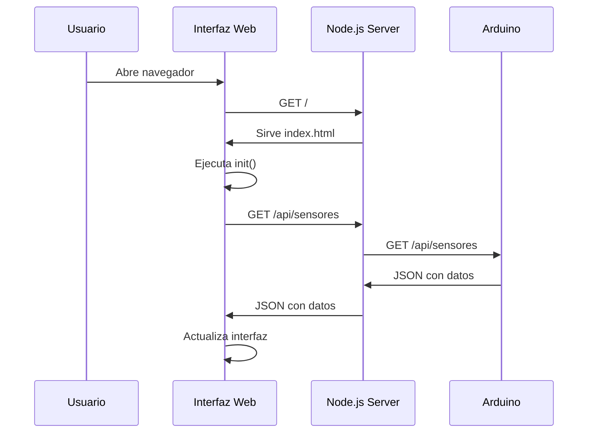
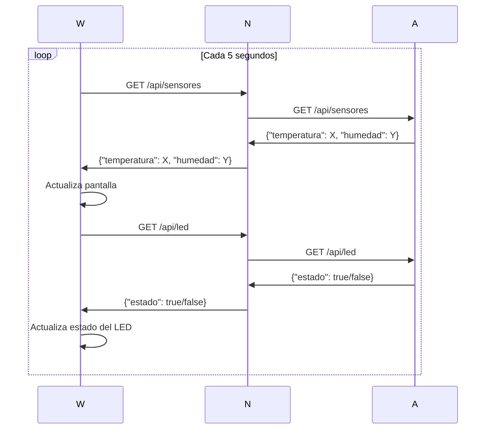
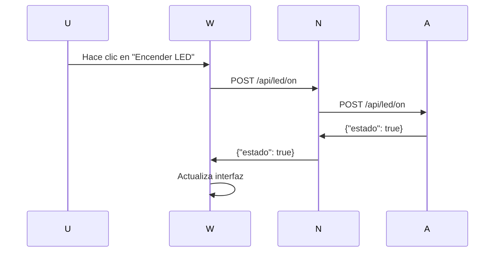

# Robotica_01

# 🌐 Control Web con Arduino (Ethernet + DHT11 + Motor + Relé)

Este proyecto permite controlar un foco, un LED, y un motor paso a paso a través de una página web, además de monitorear en tiempo real la temperatura y la humedad usando un sensor DHT11.

---

## 🧰 Tecnologías y Componentes

### 🔌 Electrónica
- Arduino UNO
- Módulo Ethernet W5100
- Sensor DHT11
- Módulo Relé 5V
- LED Azul
- Resistencia 220Ω
- Motor paso a paso (28BYJ-48 o NEMA 23)
- Driver DRV8825
- Fuente de alimentación externa (para el motor)

### 💻 Software
- IDE de Arduino
- Librerías:
  - `Ethernet.h`
  - `SPI.h`
  - `DHT.h`
  - `ArduinoJson.h`

---

## ⚡ Esquema Electrónico

```text
[DHT11]          → Pin 2  
[LED Azul]       → Pin 6  
[Relé 220V]      → Pin 7  
[Motor DRV8825]  → Step=8, Dir=9, Enable=10  
[Ethernet W5100] → Conectado por SPI 
```


## 🔹 1. Conexión del LED Azul

### 🧩 Componentes necesarios:
- 1 x LED azul
- 1 x Resistencia de 220Ω
- Cables dupont

### ⚙️ Conexiones:
| Elemento                      | Arduino UNO     |
|-------------------------------|------------------|
| Ánodo (patita larga) del LED  | Pin digital 6    |
| Cátodo (patita corta) del LED | GND (a través de la resistencia de 220Ω) |

> ⚠️ **Importante**: La resistencia es necesaria para evitar quemar el LED. Conéctala entre el cátodo del LED y tierra (GND).

### 🔌 Esquema Fritzing:


### 💡 Funcionamiento:
El LED se controla desde el navegador web. Al acceder a las rutas:
- `/ONA` → Enciende el LED (HIGH en pin 6)
- `/OFFA` → Apaga el LED (LOW en pin 6)

Esto se logra gracias a la interfaz web servida por el módulo Ethernet W5100.

## 🔹 2. Conexión del Foco 220V con Relé

### 🧩 Componentes necesarios:
- 1 x Módulo Relé de 1 canal (5V)
- 1 x Foco o bombilla 220V (puede ser incandescente o LED)
- 1 x Portafoco
- Cableado para 220V (con precaución)
- Cables dupont

### ⚙️ Conexiones (lado Arduino):
| Módulo Relé | Arduino UNO |
|-------------|--------------|
| IN          | Pin digital 7 |
| VCC         | 5V           |
| GND         | GND          |

### ⚠️ Conexiones (lado 220V CA):
- **COM** (común): uno de los cables del foco.
- **NO** (normalmente abierto): cable vivo de 220V.
- El otro cable del foco va directo al neutro de 220V.

> ⚠️ **Precaución**: Este montaje trabaja con corriente alterna. Asegúrate de desconectar la energía antes de conectar el relé al foco y utiliza cinta aislante o terminales seguros. Si no estás familiarizado con electricidad domiciliaria, busca ayuda de un técnico.

### 🔌 Esquema Fritzing:


### 💡 Funcionamiento:
Desde el navegador puedes encender y apagar el foco con estas rutas:
- `/ONR` → Activa el relé (enciende el foco)
- `/OFFR` → Desactiva el relé (apaga el foco)

El pin 7 del Arduino controla el pin IN del relé. Cuando se activa (`LOW` en relés activos bajos), el relé cierra el contacto y permite el paso de corriente al foco.

## 🔹 3. Conexión del Sensor DHT11

### 🧩 Componentes necesarios:
- 1 x Sensor DHT11
- 1 x Resistencia de 10kΩ (pull-up, opcional pero recomendada)
- Cables dupont

### ⚙️ Conexiones:
| Pin DHT11 | Arduino UNO |
|-----------|--------------|
| VCC       | 5V           |
| DATA      | Pin digital 2 |
| GND       | GND          |

> 🔧 **Nota**: Puedes colocar una resistencia de **10kΩ** entre VCC y DATA como resistencia de pull-up para una mejor estabilidad de la señal.

### 🔌 Esquema Fritzing:


### 🌡️ Funcionamiento:
El sensor se inicializa en el código con la librería `DHT.h`, usando:

```cpp
#define DHTPIN 2
#define DHTTYPE DHT11
DHT dht(DHTPIN, DHTTYPE);
```


## 🔹 4. Conexión del Motor Paso a Paso con DRV8825

### 🧩 Componentes necesarios:
- 1 x Motor paso a paso (por ejemplo: NEMA 23)
- 1 x Driver DRV8825
- 1 x Protoboard
- Cables dupont
- Fuente externa (12V – opcional pero recomendada para mayor torque)
- 1 x Capacitor 100µF (entre VMOT y GND del DRV8825)

### ⚙️ Conexiones (DRV8825 ↔ Arduino UNO):

| Pin DRV8825 | Arduino UNO     |
|-------------|------------------|
| STEP        | Pin 8            |
| DIR         | Pin 9            |
| ENABLE      | Pin 10           |
| GND         | GND              |
| VMOT        | +12V (fuente externa) |
| GND (VMOT)  | GND (fuente externa) |
| VDD         | 5V               |
| GND (VDD)   | GND              |
| A1, A2, B1, B2 | Motor (según datasheet del motor) |

> ⚠️ **Importante**: Antes de conectar el motor o encender la fuente, ajusta el potenciómetro del DRV8825 para limitar la corriente y proteger el motor.

### 🔌 Esquema Fritzing:


### 🔁 Funcionamiento:
El motor se controla desde la interfaz web mediante el formulario de grados. El Arduino convierte los grados solicitados en pasos, y el DRV8825 los ejecuta con microstepping (configurable).

Código relevante:
```cpp
void moverMotor(float angle) {
  boolean direction = (angle >= 0);
  long steps = (long)((abs(angle) / 360.0) * totalStepsPerRevolution);

  digitalWrite(dirPin, direction ? HIGH : LOW);
  digitalWrite(enablePin, LOW);

  for (long i = 0; i < steps; i++) {
    digitalWrite(stepPin, HIGH);
    delayMicroseconds(2000);
    digitalWrite(stepPin, LOW);
    delayMicroseconds(2000);
  }

  digitalWrite(enablePin, HIGH);
}
```
# Sistema de Control Arduino con API REST

Este proyecto implementa un sistema de monitoreo y control de sensores usando Arduino como servidor de API REST, con una interfaz web moderna desarrollada en Node.js.

## 📋 Descripción General

El sistema está dividido en tres componentes principales:

- **Arduino como Servidor API**: Funciona como un servidor web minimalista que expone endpoints REST para leer sensores y controlar actuadores.
- **Servidor Node.js**: Actúa como intermediario entre el Arduino y el cliente web, proporcionando una capa de abstracción.
- **Interfaz Web**: Frontend moderno y responsivo que consume la API y presenta los datos en tiempo real.

## 🏗️ Arquitectura del Sistema

```
┌─────────────────┐    HTTP/REST    ┌─────────────────┐    HTTP/REST    ┌─────────────────┐
│                 │ <-------------> │                 │ <-------------> │                 │
│  Interfaz Web   │                 │ Servidor Node.js│                 │ Arduino Uno +   │
│  (Frontend)     │                 │   (Proxy)       │                 │ Ethernet Shield │
│                 │                 │                 │                 │                 │
└─────────────────┘                 └─────────────────┘                 └─────────────────┘
     Puerto 3000                         Puerto 3000                      IP: 192.168.10.31
```

### Flujo de Datos

1. **Actualización Automática**: Cada 5 segundos, la interfaz web solicita datos actualizados.
2. **Proxy Inteligente**: Node.js recibe la solicitud y la reenvía al Arduino.
3. **Respuesta JSON**: Arduino responde con datos de sensores en formato JSON liviano.
4. **Presentación Visual**: La interfaz actualiza los valores mostrados al usuario.
5. **Control de Dispositivos**: Los comandos de control se envían de forma similar pero inversa.

## 🔧 Componentes del Hardware

- Arduino Uno + Ethernet Shield
- **Sensor DHT11**: Conectado al pin digital 8 para lectura de temperatura.
- **Sensor de Humedad Analógico**: Conectado al pin A0.
- **LED de Control**: Conectado al pin digital 6.
- **Ethernet Shield**: Para conectividad de red.

### Configuración de Red

- Dirección MAC: `{0xDE, 0xAD, 0xBE, 0xEF, 0xAB, 0xCA}`
- Dirección IP: `192.168.10.31`
- Puerto: `80` (HTTP estándar)

## 🚀 API REST del Arduino

El Arduino implementa un servidor HTTP minimalista que expone los siguientes endpoints:

| Método | Endpoint       | Descripción                      | Respuesta                        |
|--------|----------------|----------------------------------|----------------------------------|
| GET    | /api/sensores  | Obtiene datos de todos los sensores | `{"temperatura": 25, "humedad": 60}` |
| GET    | /api/led       | Consulta el estado actual del LED | `{"estado": true}`              |
| POST   | /api/led/on    | Enciende el LED                   | `{"estado": true}`              |
| POST   | /api/led/off   | Apaga el LED                      | `{"estado": false}`             |

### Ejemplo de Comunicación

```
GET /api/sensores HTTP/1.1
Host: 192.168.10.31

HTTP/1.1 200 OK
Content-Type: application/json
Access-Control-Allow-Origin: *
Connection: close

{"temperatura":23.5,"humedad":65}
```

## 🖥️ Servidor Node.js (Proxy)

El servidor Node.js actúa como intermediario y proporciona las siguientes funcionalidades:

### Funciones Principales

- Proxy HTTP
- Manejo de Errores
- Servicio de Archivos
- CORS

### Configuración del Servidor

```javascript
const ARDUINO_IP = '192.168.10.31';
const ARDUINO_URL = `http://${ARDUINO_IP}`;
const port = 3000;
```

## 🎨 Interfaz Web

### Características Principales

- Actualización Automática
- Diseño Responsivo
- Indicadores Visuales
- Controles Interactivos

### Ciclo de Actualización

```javascript
setInterval(updateAllData, 5000);

async function updateAllData() {
    const sensorSuccess = await fetchSensorData();
    if (sensorSuccess) {
        await fetchLedStatus();
    }
}
```

### Estados de la Interfaz

| Estado       | Indicador Visual | Descripción                       |
|--------------|------------------|-----------------------------------|
| Conectado    | 🟢 Verde          | Comunicación exitosa con Arduino |
| Desconectado | 🔴 Rojo           | Sin comunicación con Arduino     |
| Cargando     | ⚪ Gris           | Procesando solicitud             |

## 📦 Instalación y Configuración

### Requisitos Previos

- Arduino IDE
- Node.js (versión 14 o superior)
- Arduino Uno + Ethernet Shield
- Sensor DHT11
- Sensor de humedad analógico

### Instalación paso a paso

#### 1. Configuración del Arduino

```bash
# Instalar bibliotecas necesarias:
# - DHT sensor library
# - ArduinoJson
# - Ethernet library

# Cargar el código arduino_api.ino al Arduino
```

#### 2. Configuración del Servidor Node.js

```bash
mkdir arduino-web-control
cd arduino-web-control
npm init -y
npm install express axios
mkdir public
```

#### 3. Ejecución del Sistema

```bash
node server.js
```

Accede a: `http://localhost:3000`

## 🔄 Flujo de Funcionamiento Detallado

### 1. Inicialización del Sistema



### 2. Actualización Periódica



### 3. Control de Dispositivos



## 🛠️ Personalización y Extensión

### Añadir Nuevos Sensores

```cpp
void enviarDatosSensores(EthernetClient &cliente) {
    float temperatura = dht.readTemperature();
    int humedad = map(analogRead(A0), 0, 1023, 0, 100);
    int nivelLuz = analogRead(A1);

    JsonDocument doc;
    doc["temperatura"] = temperatura;
    doc["humedad"] = humedad;
    doc["luz"] = map(nivelLuz, 0, 1023, 0, 100);

    enviarEncabezadoHTTP(cliente, "application/json");
    serializeJson(doc, cliente);
}
```

```html
<!-- En el dashboard -->
<div class="card">
    <h2>Nivel de Luz</h2>
    <div class="sensor-value" id="luz">--<span class="sensor-unit">%</span></div>
</div>
```

```javascript
function updateSensorData(data) {
    temperaturaElement.innerHTML = `${formatSensorValue(data.temperatura)}<span class="sensor-unit">°C</span>`;
    humedadElement.innerHTML = `${formatSensorValue(data.humedad)}<span class="sensor-unit">%</span>`;
    document.getElementById('luz').innerHTML = `${formatSensorValue(data.luz)}<span class="sensor-unit">%</span>`;
}
```

### Añadir Nuevos Actuadores

```cpp
else if (solicitud.indexOf("POST /api/led2/on") >= 0) {
    digitalWrite(LED2_PIN, HIGH);
    enviarRespuestaEstado(cliente, true);
}
```